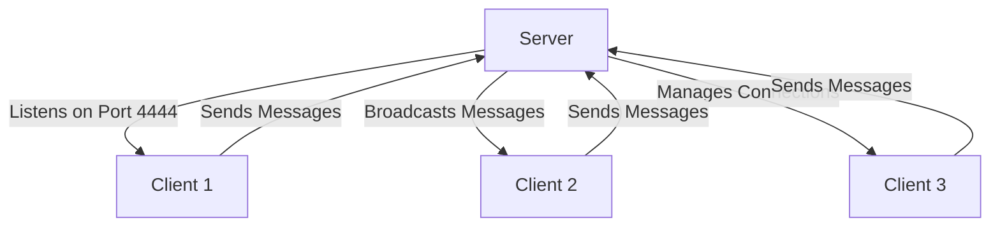

# 📡 Java Multi-Client Chat Application

A simple yet powerful multi-client chat server built with Java sockets and multi-threading. Broadcast messages in real-time to all connected clients! 🚀


## 🌟 Features

- **Real-time Messaging** 💬  
  Instantly send and receive messages across all connected clients.

- **Multi-Client Support** 👥  
  Handle multiple clients simultaneously using threads.

- **Simple Architecture** 🏗️  
  Clean server-client model with intuitive code structure.

- **Console Interface** ⌨️  
  Lightweight terminal-based interaction.

## 🛠️ How It Works



### Key Components
- **`Server`**: Manages client connections and message broadcasting.
- **`Client`**: Connects to server and handles I/O.
- **`Broadcast`**: Thread task to relay messages between clients.
- **`RelyMessage`**: Handles client-side message input.

## 🚀 Getting Started

### Prerequisites
- Java 17+ JDK
- Basic terminal knowledge

### Installation & Usage

1. **Clone the Repository**
   ```bash
   git clone https://github.com/yourusername/java-chat-app.git
   cd java-chat-app
   ```

2. **Compile the Code**
   ```bash
   javac Server.java Client.java Broadcast.java RelyMessage.java
   ```

3. **Run the Server** (In separate terminal)
   ```bash
   java Server
   ```

4. **Launch Clients** (In new terminals)
   ```bash
   java Client
   ```

5. **Start Chatting!**  
   Type messages in any client terminal - they'll appear in all others!

## 🧩 Code Structure

| Class           | Description                                                                 |
|-----------------|-----------------------------------------------------------------------------|
| `Server`        | Creates server socket, manages client connections and output streams       |
| `Client`        | Connects to server, handles message input/output                           |
| `Broadcast`     | Server-side thread that broadcasts messages to all clients (except sender) |
| `RelyMessage`   | Client-side thread that sends user input to server                         |

## 🧠 Technical Highlights

```java
// Server-side broadcasting logic (Broadcast.java)
for (int i = 0; i < out.size(); i++) {
    if (i == index) continue;  // Skip sender
    out.get(i).println(message);
}
```

```java
// Client message input handling (RelyMessage.java)
message = name + ": " + scanner.nextLine();
out.println(message);
```

## 🤝 Contributing

Pull requests welcome! For major changes, please open an issue first.

1. Fork the Project
2. Create your Feature Branch (`git checkout -b feature/AmazingFeature`)
3. Commit your Changes (`git commit -m 'Add some AmazingFeature'`)
4. Push to the Branch (`git push origin feature/AmazingFeature`)
5. Open a Pull Request

## 📜 License

Distributed under the MIT License. See `LICENSE` for more information [](https://opensource.org/licenses/MIT).

---

Made with ❤️ by PiccioHub | [](https://github.com/Piccio-Code)


