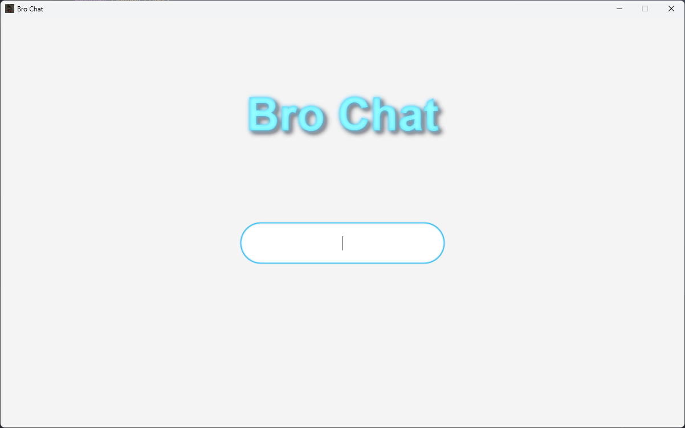
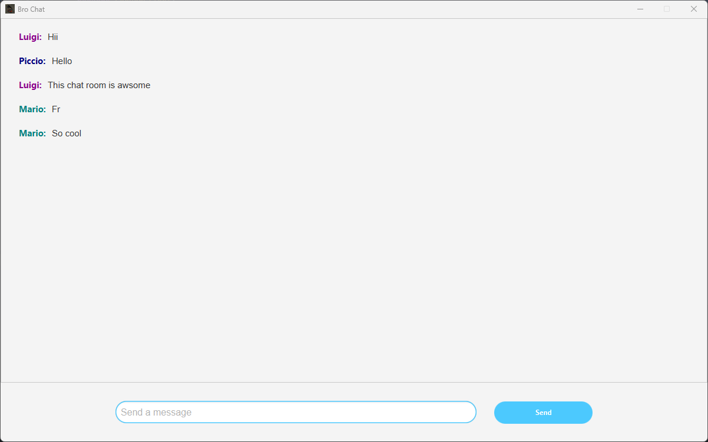
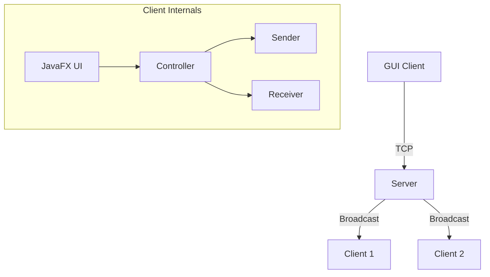

Here's an updated, professional README for your GUI chat application:


# 💬 Bro Chat - Modern JavaFX Chat Application


A modern GUI chat application with real-time messaging, built using JavaFX and Java sockets.




## 🌟 Features

### Modern UI Components
- 🖥️ Clean JavaFX interface
- 🎨 CSS styling with dark theme
- 🔑 Login screen with username validation
- 📜 Scrollable chat history
- 🎭 Random username colors for differentiation

### Core Functionality
- 🌐 Real-time message broadcasting
- 👥 Multi-client support
- 🔄 Background message polling
- ✉️ Message formatting (Name: Message)
- 🚫 Input validation for empty messages

### Technical Features
- 🧵 Multi-threaded server architecture
- 🔒 TCP socket communication
- 📤📥 Bidirectional messaging (Sender/Receiver)
- 🎮 MVC pattern implementation
- 📱 Responsive UI components

## 🛠️ Architecture



## 📦 Code Structure

| Package       | Class          | Responsibility                          |
|---------------|----------------|-----------------------------------------|
| `GUI`         | `UI`           | Main application window setup           |
|               | `Controller`   | Message handling and UI updates         |
|               | `LoginController` | Username input management             |
| `ServerClient`| `Server`       | Central message broker                  |
|               | `Sender`       | Outgoing message processor              |
|               | `Receiver`     | Incoming message handler                |
|               | `Broadcast`    | Message distribution logic              |

## 🚀 Getting Started

### Prerequisites
- Java 17+ JDK
- JavaFX 19+ SDK
- Maven (recommended)

### Installation
```bash
git clone https://github.com/Piccio-Code/MessagingApp
cd bro-chat
```

### Running the Application
1. **Start the Server**:
   ```bash
   java -cp "path/to/javafx-sdk/lib/*" ServerClient.Server
   ```

2. **Launch Clients**:
   ```bash
   java -cp "path/to/javafx-sdk/lib/*:bin" GUI.UI
   ```

3. **Usage Flow**:
    - Enter username in login screen
    - Send messages with Enter/button
    - Close window to disconnect

## 🧠 Technical Highlights

### Color Differentiation
```java
// Random contrasting username colors
public static final Color[] CONTRASTING_COLORS = {
    Color.RED, Color.DARKBLUE, Color.GREEN, 
    Color.PURPLE, Color.ORANGE, Color.NAVY
};

// Applied in message display
username.setTextFill(CONTRASTING_COLORS[randomIndex]);
```

### Message Handling
```java
// Server-side broadcasting
out.values().forEach(writer -> {
    if(writer != currentUser) {
        writer.println(formattedMessage);
    }
});

// Client-side message display
Platform.runLater(() -> {
    controller.display(messageParts[1], messageParts[0]);
});
```

## 📈 Future Improvements

### Planned Features
- 🔐 User authentication
- 📎 File attachments
- 📅 Message timestamps
- 😀 Emoji support

### Technical Enhancements
- 🧹 Proper connection cleanup
- 🛡️ SSL encryption

## 🤝 Contributing

1. Fork the repository
2. Create feature branch (`git checkout -b feature/awesome-feature`)
3. Commit changes (`git commit -m 'Add awesome feature'`)
4. Push branch (`git push origin feature/awesome-feature`)
5. Open Pull Request

## 📜 License

MIT License - See [LICENSE](LICENSE) for details

---

**Bro Chat** - Made with ❤️ by Lorenzo Piccini @(Piccio Hub) | [](https://github.com/Piccio-Code)
```